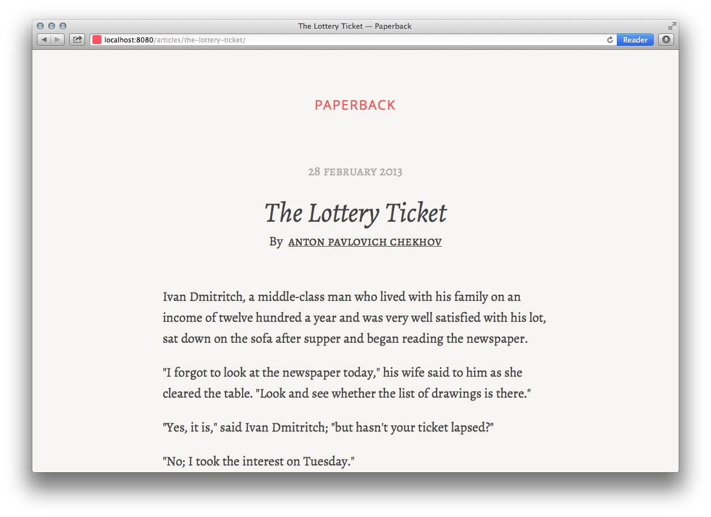

# Paperback



**Paperback is a theme for Wintersmith** inspired by the typography of printed novels and informed by blog posts about the digital reading experience written by [Information Architects](http://informationarchitects.net/blog/responsive-typography-the-basics/), among others.

## Features

### Scale and rhythm

Font sizes and spacings use the [3:5 single-stranded Fibonacci scale](http://lamb.cc/typograph/).

### Responsiveness

The site is responsive to two size ranges, with a breakpoint just below a typical tablet portrait screen width.

## Installation

### Wintersmith

Install [Wintersmith](https://github.com/jnordberg/wintersmith#quick-start) on your system using [npm](https://npmjs.org/).

### Stylus

Paperback uses [Stylus](https://github.com/learnboost/stylus) to generate CSS. Install the Wintersmith [Stylus plugin](https://github.com/jnwng/wintersmith-stylus) next.

### Replace skeleton site with Paperback

After installation of Wintersmith and its Stylus plugin are complete, run `$ wintersmith new <path>` to generate a skeleton site in the `<path>` that you specify.

Replace these skeleton directories and files with those of Paperback.

## Configuration

### Posts

Save posts in **contents/articles/<post-directory-name>** as index.md. Be sure to include the metadata as in the example posts.

In the Markdown file, be sure to denote the "read more" break by placing

```
<span class="more"></span>
```

between the introduction text and the rest of the content.

Use `<h2>` as the largest header, as the post title will be automatically generated as `<h1>` from the  title specified in the metadata.


### Authors

Add authors by creating a .json file in **contents/authors/**. The author metadata in the post Markdown file should correspond to the .json file name.

## Next steps

- Ability to sort through tag metadata to generate a dedicated page for a particular tag.
- Author page that makes use of the author's bio metadata.